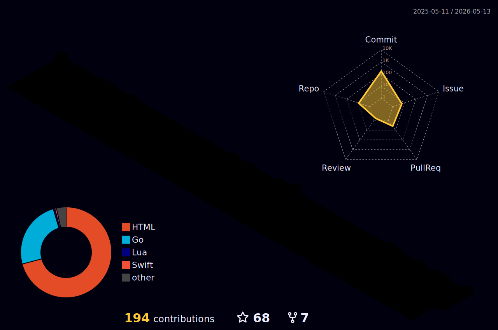

# Vincent Chyu

<div align="center">

### 卑鄙是卑鄙者的通行证，高尚是高尚者的陋室铭


<br/>


</div>

---

# About Me

```swift
struct Developer {

    let name        = "Vincent Chyu"
    let role        = "AI Engineer"
    let language    = ["Go", "Java", "TypeScript", "Swift"]
    let database    = ["MySQL", "Redis", "PostgreSQL"]
    let platform    = ["macOS", "Linux", "Cloud Native"]
    let architecture = [
        "Microservices",
        "Distributed Systems",
        "AI Infrastructure"
    ]
}
```

<div align="center">

</div>
